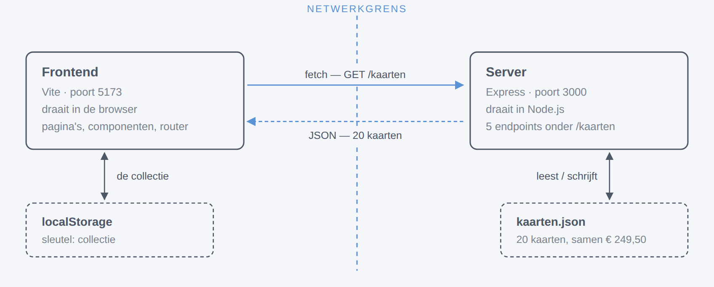
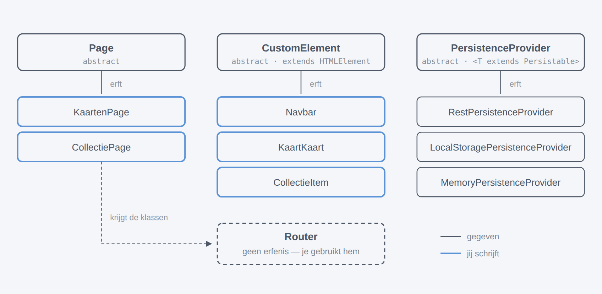
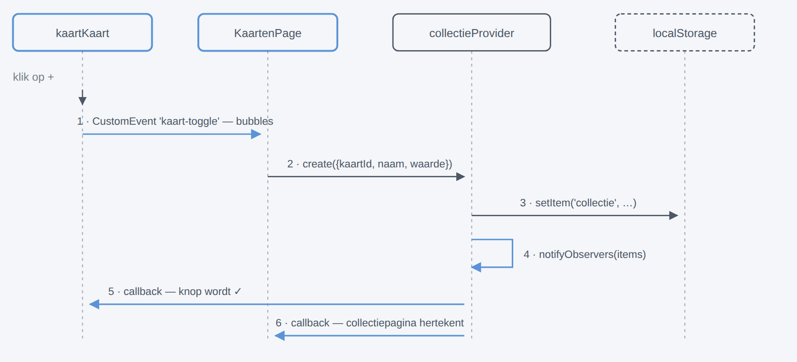
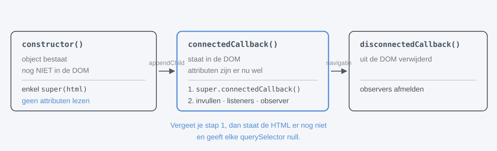
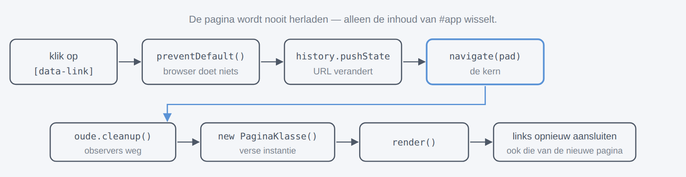
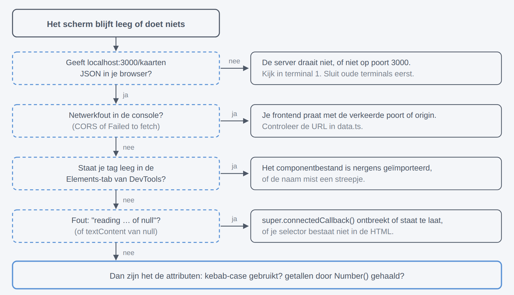
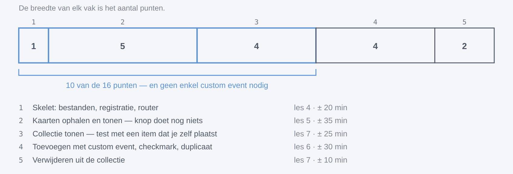

*Cursus · 9 lessen + 2 bijlagen · met oefenpakket · augustus 2026*

# Het examen aanpakken, begrijpen en maken

Van "ik zie een map met bestanden" naar "ik weet waarom elke regel er staat". Negen lessen, zeven schema’s, oefeningen met oplossingen, en drie projecten om mee te werken: een kaal beginproject, een beginproject met steigers, en de volledige oplossing.

## Les 0 — Zo gebruik je deze cursus

Deze cursus staat op zichzelf: je hebt er niets anders bij nodig. Naast de tekst hoort een oefenpakket met drie projecten. Lezen alleen levert weinig op — het gaat om de wisselwerking tussen de twee.

> #### Na deze les
>
> - weet je welke drie projecten je hebt en waarvoor elk dient;
> - heb je beide projecten draaiend en weet je dat het werkt.

### De drie mappen

| Map                           | Wat het is                                | Wanneer                                           |
|-------------------------------|-------------------------------------------|---------------------------------------------------|
| `1-Beginproject-kaal`         | exact de startbestanden van het examen    | ronde 2: jezelf testen onder examenomstandigheden |
| `2-Beginproject-met-steigers` | dezelfde bestanden, met genummerde TODO’s | ronde 1: meewerken met de lessen                  |
| `3-Oplossingsproject`         | de volledig uitgewerkte oplossing         | nakijken en vergelijken                           |

De TODO’s in het steigerproject zijn genummerd per les: `TODO 4.1` hoort bij les 4, `TODO 6.3` bij les 6. Elke les eindigt met een blok *Doe dit* dat zegt welke TODO’s aan de beurt zijn, en een *controlepunt*: wat er moet werken voor je verdergaat.

> **Twee rondes**
>
> **Ronde 1** doe je met de steigers ernaast, terwijl je leest. **Ronde 2** doe je later opnieuw vanaf het kale beginproject, met alleen `opgave.md` en een timer. Pas in die tweede ronde weet je of je het kan — meelezen voelt altijd alsof je het begrijpt.

### Alles opstarten

```bash
# Terminal 1 — de server (laat open staan)
cd 2-Beginproject-met-steigers/Server
pnpm install
pnpm dev            # → Server is running at http://localhost:3000

# Terminal 2 — de frontend (laat open staan)
cd 2-Beginproject-met-steigers/Frontend
pnpm install
pnpm dev            # → http://localhost:5173
```

> **Controlepunt**
>
> Open `http://localhost:3000/kaarten` in je browser: je ziet JSON met twintig kaarten. Open `http://localhost:5173`: je ziet een lege pagina. Dat is correct — de router is nog niet gekoppeld. Dat is precies waar les 4 begint.

## Les 1 — Het landschap

Voor je één regel schrijft: wat staat er eigenlijk, en wie praat met wie? Het examen geeft je twee losse programma’s en twee plaatsen waar data leeft. Wie dat scherp heeft, weet bij elk probleem meteen in welke helft hij moet zoeken.

> #### Na deze les
>
> - kan je uitleggen waarom dit twee projecten zijn en geen één;
> - weet je waar de kaarten leven en waar de collectie leeft, en waarom dat verschilt;
> - kan je de API bevragen zonder de frontend te gebruiken.

### Twee programma’s, twee soorten data



*Figuur 1 — Wie praat met wie. De kaarten steken de netwerkgrens over; de collectie nooit. Daarom blijft je collectie staan als je de server afsluit, en verdwijnt ze als je de localStorage van localhost wist. Die twee bronnen krijgen elk hun eigen provider — les 3.*

Twee losse projecten dus: elk een eigen `package.json`, een eigen `node_modules`, een eigen `tsconfig.json`. Ze delen geen enkele regel code. Het enige wat ze gemeen hebben is de *vorm* van de data die over de lijn gaat — en die staat twee keer opgeschreven, één keer in elk project:

*Frontend/src/models/tradingCard.ts*

```typescript
export interface TradingCard {
  id: string
  naam: string
  serie: string
  type: string
  zeldzaamheid: 'gewoon' | 'ongewoon' | 'zeldzaam' | 'legendarisch'
  aanvalskracht: number
  waarde: number
}
```

> **Onthoud dit voor later**
>
> Groeien die twee bestanden uit elkaar, dan merkt geen enkele compiler dat. Er is geen verband tussen `Server/src/models/tradingCard.ts` en `Frontend/src/models/tradingCard.ts` behalve jouw discipline. Op dit examen hoef je ze niet te wijzigen, maar in je eigen projecten is dit de klassieke bron van "het werkte gisteren nog".

### De API zelf bevragen

Dit is de belangrijkste gewoonte uit deze les. Kan je de server rechtstreeks bevragen, dan weet je bij elk probleem meteen in welke helft je moet zoeken.

```bash
# In je browser — GET-verzoeken kan je gewoon openen:
http://localhost:3000/kaarten
http://localhost:3000/kaarten/550e8400-e29b-41d4-a716-446655440003

# Of in een terminal:
curl http://localhost:3000/kaarten
curl -i http://localhost:3000/kaarten/bestaat-niet     # → 404
```

> **Doe dit**
>
> Nog geen code. Start beide projecten, open `http://localhost:3000/kaarten`, en zoek in die JSON een kaart met zeldzaamheid `legendarisch`. Open daarna `Frontend/src/index.css` en kijk welke vier klassen daar gedefinieerd staan. Dat is geen toeval.

> #### Oefeningen
>
> 1.  Hoeveel verschillende *series* zitten er in `kaarten.json`? En hoeveel *types*?
> 2.  Stop de server (Ctrl+C) en herlaad de frontend. Wat zou je verwachten dat er met de kaarten gebeurt, en met de collectie? Waarom?
> 3.  Waarom staat er in `server.ts` een regel `server.use(cors())`? Wat zou er gebeuren zonder?

> **Leerstof:** PIT-les 7 (*Vite*) voor de frontend-opzet · Freeman hfst. 1–2 voor wat TypeScript is en een eerste project.

## Les 2 — De vier bouwstenen

Alle moeilijke code is al geschreven. Vier abstracte klassen dragen de hele applicatie, en jouw werk bestaat eruit ervan te erven. Als je deze les begrijpt, is de rest van het examen invulwerk.

> #### Na deze les
>
> - ken je de vier gegeven bouwstenen en wat elk van hen voor je doet;
> - weet je welke klassen jij schrijft en welke je alleen gebruikt;
> - begrijp je waarom `abstract` hier de juiste keuze is.



*Figuur 2 — Wie erft van wie. Van de elf klassen schrijf jij er vijf, en die bestaan bijna volledig uit super(html) en één overschreven methode. De providers erven ook, maar die zijn al voor je geschreven: jij kiest alleen wélke je gebruikt.*

### 1. `Page` — een pagina

*Frontend/src/router/page.ts*

```typescript
export abstract class Page {
  protected readonly body: HTMLDivElement
  protected unsubscribe: Unsubscribe[] = []
  static readonly #root = document.querySelector<HTMLDivElement>('#app')!

  protected constructor(body: string) {
    this.body = document.createElement('div')
    this.body.innerHTML = body
  }

  render() {
    Page.#root.innerHTML = ''
    Page.#root.appendChild(this.body)
  }

  cleanup() {
    this.unsubscribe.forEach(x => { x() })
    this.unsubscribe = []
  }
}
```

- `this.body` is een losse `<div>` in het geheugen met jouw HTML erin. Hij hangt nog nergens. Dáárom mag je er in de constructor al listeners op zetten.
- `render()` leegt `#app` en hangt die div erin. Jij overschrijft deze methode en roept **eerst** `super.render()` aan — anders staat je HTML nog niet in de DOM.
- `unsubscribe` en `cleanup()` horen bij les 3. De router roept `cleanup()` zelf aan wanneer je de pagina verlaat.

### 2. `CustomElement` — je eigen HTML-tag

Na `customElements.define('custom-navbar', Navbar)` mag `<custom-navbar></custom-navbar>` letterlijk in je HTML staan, en maakt de browser er zelf een `Navbar`-object van. Twee regels die geen foutmelding geven als je ze vergeet:

- de naam **moet** een streepje bevatten;
- `define` draait pas wanneer het bestand geïmporteerd wordt.

### 3. `Router` — navigeren zonder herladen

De router is de enige bouwsteen waar je niet van erft: je geeft hem een tabel en verder doet hij zijn werk. Let op het type dat hij verwacht:

```typescript
type ConcretePage = new () => Page
type RouteMap = Record<string, ConcretePage>
```

Lees dat als: "iets waar je `new` op kan doen zonder argumenten, en dat een `Page` oplevert". Je geeft dus **klassen** door, geen instanties: `{'/': KaartenPage}` en niet `{'/': new KaartenPage()}`.

### 4. `PersistenceProvider<T>` — waar data vandaan komt

Eén abstracte klasse met vijf methodes (`create`, `get`, `getAll`, `update`, `delete`) en drie implementaties. Ze zijn onderling verwisselbaar: je pagina merkt het verschil niet.

| Provider                          | Bewaart in                  | In dit examen                    |
|-----------------------------------|-----------------------------|----------------------------------|
| `RestPersistenceProvider`         | de API op poort 3000        | **verplicht** voor de kaarten    |
| `LocalStoragePersistenceProvider` | localStorage van de browser | **verplicht** voor de collectie  |
| `MemoryPersistenceProvider`       | een array in het geheugen   | niet nodig — handig om te testen |

> **Waarom abstract?**
>
> Een abstracte klasse kan je niet instantiëren; ze bestaat om van te erven. `new Page()` is een fout, `new KaartenPage()` niet. Dat is precies wat je wil: `Page` in zijn eentje kan niets tonen, want hij weet niet wélke pagina hij is. De klasse legt vast wat elke pagina gemeen heeft en laat de rest aan jou.

> #### Oefeningen
>
> 1.  Waarom staat `#root` in `Page` als `static`? Wat zou er veranderen als het een gewoon veld was?
> 2.  `Page` gebruikt `protected` voor `body`, maar `#pages` in de `Router` is privé met een hekje. Wat is het verschil, en waarom is die keuze hier logisch?
> 3.  Kan je `MemoryPersistenceProvider` gebruiken voor de collectie in plaats van localStorage? Werkt de applicatie dan nog? En haal je de punten?

> **Leerstof:** PIT-les 8 (*Multipage apps*) — abstracte klassen, Page, custom elements en de router · Goldberg hfst. 8 (*Classes*) · Freeman hfst. 11.

## Les 3 — Het observer-patroon

Dit is het hart van het examen. In de opgave staat letterlijk dat elke wijziging *meteen* zichtbaar moet zijn, niet pas na een refresh, en dat je dat doet met het observer-patroon uit de providers. Wie dit begrijpt, schrijft de rest bijna vanzelf.

> #### Na deze les
>
> - weet je welk probleem het observer-patroon oplost;
> - kan je het pad van één muisklik tot bijgewerkt scherm uittekenen;
> - weet je waarom je je moet afmelden, en wat er gebeurt als je dat niet doet.

### Het probleem

`render()` is synchroon: hij moet nú iets op het scherm zetten. Data ophalen is asynchroon: dat duurt. Je zou kunnen wachten, maar dan staat je pagina te blokkeren — en erger: als de data later verandert, weet je scherm dat niet.

De oplossing draait de vraag om. In plaats van *"geef mij de data"* zeg je *"laat het me weten wanneer de data verandert"*:

*Frontend/src/data/persistenceProvider.ts (fragment)*

```typescript
addObserver(observer: ChangeObserver<T>): Unsubscribe {
  this.observers.push(observer)
  return () => {
    this.observers = this.observers.filter(x => x !== observer)
  }
}
```

Je geeft een functie mee, en je krijgt een functie terug waarmee je je weer afmeldt. Elke methode die de data wijzigt — en ook `getAll()` — eindigt met `notifyObservers(...)`, en dan draait jouw callback met de nieuwe lijst.

### Het pad van één klik



*Figuur 3 — Wat er gebeurt bij één klik. Let op stap 5 en 6: de kaart en de pagina werken zichzelf bij zonder dat iemand het hun vraagt. De pagina hoeft de knop niet te kennen en de knop de pagina niet — ze luisteren allebei naar dezelfde provider. Dat is wat de opgave bedoelt met "meteen zichtbaar, niet pas na een refresh".*

### Het vaste recept

Overal in dit examen komt hetzelfde drieluik terug. Leer het als één geheel:

```typescript
render() {
  super.render()                                    // 1. HTML in de DOM

  this.unsubscribe.push(                            // 2. abonneren, en de
    provider.addObserver(data => this.#toon(data)), //    afmeldfunctie bewaren
  )

  void provider.getAll()                            // 3. ophalen — dit verwittigt
}                                                   //    meteen alle observers
```

Stap 3 is de subtiele: `getAll()` haalt niet alleen op, hij roept ook `notifyObservers` aan. Dat is geen bijwerking waar je omheen moet werken — het is hoe je de eerste weergave in gang zet.

### Waarom afmelden verplicht is

`addObserver` geeft een functie terug. Duw je die in `this.unsubscribe`, dan roept de router hem op wanneer je de pagina verlaat. Doe je dat niet, dan gebeurt dit: je navigeert vijf keer heen en weer, er staan vijf observers van vijf dode pagina’s te luisteren, en bij de volgende wijziging proberen ze alle vijf een pagina te hertekenen die niet meer bestaat. In een custom element doe je hetzelfde in `disconnectedCallback()`.

> #### Oefeningen
>
> 1.  Wat gebeurt er als je in het recept hierboven stap 3 weglaat? En als je stap 2 en 3 omdraait?
> 2.  De opgave zegt dat je de collectie via de `LocalStoragePersistenceProvider` moet aanpassen. Wat zou er misgaan als je in plaats daarvan rechtstreeks `localStorage.setItem(...)` schrijft?
> 3.  In figuur 3 gaat pijl 5 naar de kaart en pijl 6 naar de pagina. Wie heeft die twee callbacks geregistreerd, en wáár in de code?

> **Leerstof:** PIT-les 9 (*Data management*) — hier staat het observer-patroon en de unsubscribe uitgelegd · Goldberg hfst. 10 (*Generics*) voor de `<T extends Persistable>` in de providers.

## Les 4 — Het skelet (1 punt)

Nu ga je typen. Het doel van deze les is niet functionaliteit maar *structuur*: alle bestanden bestaan, alle elementen zijn geregistreerd, beide pagina’s zijn bereikbaar. Daarna kan je alles testen wat je erna bouwt — en dat is de reden om hiermee te beginnen.

> #### Na deze les
>
> - staan je twee pagina’s op `/` en `/collectie` en werken de navbar-links;
> - zijn de drie custom elements geregistreerd;
> - bestaan je twee providers op één centrale plaats;
> - weet je waarom een vergeten import je element stil laat mislukken.

### De levensloop van een custom element

Voor je componenten schrijft, moet je weten wanneer je wát mag doen. Dit is de bron van de helft van alle vastlopers.



*Figuur 4 — Wanneer mag je wát. In de constructor bestaat het element wel, maar hangt het nergens: attributen lezen geeft daar niets. Al je opzetwerk hoort in connectedCallback(), en super.connectedCallback() is daar de eerste regel.*

### Wat de router doet als je op een link klikt



*Figuur 5 — Eén navigatie, van klik tot nieuw scherm. Jij schrijft hier niets van: je levert alleen de routetabel. Maar het verklaart wel twee dingen die je moet weten — dat cleanup() vanzelf je observers opruimt, en dat elke navigatie een nieuwe instantie van je pagina maakt, dus dat je in de constructor geen data mag verwachten.*

### Aan het werk

Vier soorten bestanden, in deze volgorde. Houd het bewust dom: alleen structuur.

**1. De providers** (`data/data.ts`). Twee `export const`-regels, elk met het juiste type ertussen punthaken. Nergens anders in je project maak je nog een provider aan.

**2. De drie componenten.** Elk hetzelfde stramien:

*components/navbar/navbar.ts*

```typescript
import {CustomElement} from '../../router/customElement.ts'
import html from './navbar.html?raw'      // ?raw = geef me de inhoud als string

export class Navbar extends CustomElement {
  constructor() {
    super(html)
  }
}

customElements.define('custom-navbar', Navbar)
```

**3. De twee pagina’s.** Zelfde stramien met `Page`, plus bovenaan de imports van de componenten die de pagina gebruikt.

**4. De router** in `main.ts`: één `new Router({...})` met de twee paden.

> **De stilste bug van dit examen**
>
> `customElements.define(...)` staat onderaan je componentbestand, buiten de klasse. Die regel draait pas wanneer het bestand ergens *geïmporteerd* wordt. Vergeet je die import in je pagina, dan blijft `<custom-navbar>` een lege, onbekende tag — zonder één foutmelding in de console. Importeer het componentbestand dus altijd bovenaan je pagina, ook al gebruik je de klassenaam nergens.

> **Doe dit**
>
> In het steigerproject: **TODO 4.1 tot en met 4.7**. Werk ze in volgorde af.

> **Controlepunt**
>
> Je ziet de navbar, de titel "Beschikbare kaarten" en een lege container. Klikken op "Mijn Collectie" wisselt de pagina, de URL verandert naar `/collectie`, en de pagina wordt *niet* herladen (het tabblad-icoontje knippert niet). Terugklikken werkt ook. Lukt dat, dan is het punt van vraag 1 binnen en staat je hele structuur recht.

> #### Oefeningen
>
> 1.  Haal in `kaarten.ts` tijdelijk de import van `navbar.ts` weg. Wat zie je in de browser, en wat zie je in de console? Zet hem daarna terug.
> 2.  Waarom geef je de router `KaartenPage` en niet `new KaartenPage()`? Wat zou er misgaan met dat tweede?
> 3.  Noem je navbar even `customnavbar` in plaats van `custom-navbar`. Wat zegt de browser?

> **Leerstof:** PIT-les 8 (*Multipage apps*) — router, pagina’s en custom elements met attributen.

## Les 5 — Kaarten inladen en tonen (5 punten)

De zwaarste vraag van het examen, en meteen de meest lonende: twintig kaarten op het scherm is een derde van je punten. Twee helften — een element dat één kaart toont, en een pagina die de kaarten ophaalt en de elementen aanmaakt.

> #### Na deze les
>
> - haal je data op via de `RestPersistenceProvider` met het recept uit les 3;
> - geef je gegevens door aan een custom element via attributen;
> - weet je waarom die attributen strings in kebab-case moeten zijn.

### Eerst kijken naar de gegeven HTML

Je hoeft geen HTML te schrijven. Alles staat er al, met ids die je alleen moet vullen:

*components/kaartKaart/kaartKaart.html*

```html
<span class="badge bg-primary text-uppercase small" id="serie"></span>
<span class="badge text-uppercase small" id="zeldzaamheid-badge"></span>
<h6 class="card-title text-white mb-1" id="naam"></h6>
<p class="text-secondary small mb-1" id="type"></p>
<p class="text-info small mb-1">&#x2694; <span id="aanvalskracht"></span></p>
<p class="text-success fw-bold mb-auto" id="waarde"></p>
<button type="button" id="add-button" class="btn btn-outline-primary btn-sm">+</button>
```

### Properties doorgeven: de twee regels

Een custom element krijgt zijn gegevens via **attributen**, en attributen zijn in HTML altijd tekst. Twee gevolgen waar iedereen één keer over struikelt:

- **Alles is een string.** `setAttribute('waarde', kaart.waarde)` werkt niet met een getal; je zet het om met `String(...)`, en bij het uitlezen weer terug met `Number(...)`. Vergeet je dat tweede, dan geeft `+` je geen som maar plakwerk: `"1.5" + "2.5"` wordt `"1.52.5"`.
- **Alles is kebab-case.** HTML kent geen hoofdletters in attribuutnamen. `setAttribute('kaartId', ...)` lees je niet terug met `getAttribute('kaartId')` — gebruik `kaart-id`.

Getters zijn de nette plaats om die omzetting één keer te doen:

```typescript
get kaartId(): string {
  return this.getAttribute('kaart-id') ?? ''
}

get waarde(): number {
  return Number(this.getAttribute('waarde') ?? '0')
}
```

### De pagina

Het recept uit les 3, en daarna een lus die per kaart een element maakt:

```typescript
render() {
  super.render()
  this.unsubscribe.push(kaartenProvider.addObserver(kaarten => this.#toonKaarten(kaarten)))
  void kaartenProvider.getAll()
}

#toonKaarten(kaarten: TradingCard[]) {
  const container = this.body.querySelector('#kaarten-container')!
  container.innerHTML = ''                       // eerst leegmaken, anders verdubbelt alles

  for (const kaart of kaarten) {
    const element = document.createElement('kaart-kaart')
    element.setAttribute('kaart-id', kaart.id)
    element.setAttribute('naam', kaart.naam)
    // ... de rest van de attributen
    container.appendChild(element)
  }
}
```

> **Twee kleine dingen die tellen**
>
> `this.body.querySelector(...)` en niet `document.querySelector(...)`: zo zoek je binnen je eigen pagina. En `void` voor een promise betekent "ik weet dat dit asynchroon is en ik wacht bewust niet" — dat houdt de linter tevreden.

> **Doe dit**
>
> **TODO 5.1 tot en met 5.4.** De knop laat je nog met rust; die is voor les 6.

> **Controlepunt**
>
> Twintig kaarten op de homepagina, elk met serie, naam, type, aanvalskracht, waarde en een gekleurde zeldzaamheidsbadge. De knop doet nog niets. Dit is al de volle vijf punten van deze vraag: de opgave zegt uitdrukkelijk dat de events hier nog niet afgewerkt hoeven te zijn.

> **Als het niet lukt**
>
> De opgave voorziet een vangnet: krijg je de provider niet aan de praat, maak dan zelf een array van `TradingCard`-objecten aan en gebruik die. Dat levert maximaal 3 van de 5 punten op. Doe dat pas als laatste redmiddel — maar doe het wél, want zonder kaarten op het scherm kan je ook de vragen erna niet tonen.

> #### Oefeningen
>
> 1.  Haal `container.innerHTML = ''` weg en klik een paar keer heen en weer tussen de twee pagina’s. Wat gebeurt er, en waarom?
> 2.  De badge krijgt een klasse `zeldzaamheid-...`. Waar komt de lijst van geldige waarden vandaan, en wat gebeurt er als je een niet-bestaande klassenaam toevoegt?
> 3.  Zet in `#toonKaarten` een `console.log` en tel hoe vaak die methode draait bij het laden van de pagina. Klopt dat met wat je verwachtte?

> **Leerstof:** PIT-les 9 (*Data management*) voor de providers · PIT-les 8 voor custom elements met attributen.

## Les 6 — Toevoegen aan de collectie (4 punten)

Nu komt het custom event. Vier dingen moeten kloppen: het event zelf, de opslag in localStorage, de knop die wisselt tussen + en ✓, en de melding bij een dubbele naam. Figuur 3 uit les 3 is precies deze les — leg hem ernaast.

> #### Na deze les
>
> - stuur je een custom event met data erin, en vang je het op bij de pagina;
> - weet je waarom een listener in de constructor hoort en niet in `render()`;
> - laat je een element zichzelf bijwerken via een observer.

### Waarom hier een event, en straks niet

Het element weet niet of een kaart al in de collectie zit, of er al een kaart met dezelfde naam bestaat, of wat er moet gebeuren als dat zo is. Die kennis hoort bij de pagina. Dus roept het element om hulp in plaats van zelf te beslissen:

```typescript
knop.addEventListener('click', () => {
  this.dispatchEvent(
    new CustomEvent('kaart-toggle', {
      bubbles: true,                                        // borrelt omhoog naar de pagina
      detail: {kaartId: this.kaartId, naam: this.naam, waarde: this.waarde},
    }),
  )
})
```

`bubbles: true` is wat het event van de knop, via het `<kaart-kaart>`-element, tot bij de div van je pagina brengt. Daardoor volstaat één listener voor twintig kaarten — dat heet *event delegation*.

### Opvangen bij de pagina

```typescript
constructor() {
  super(html)

  // In de CONSTRUCTOR, niet in render().
  this.body.addEventListener('kaart-toggle', evt => {
    void this.#verwerkToggle((evt as CustomEvent<KaartToggleDetail>).detail)
  })
}
```

> **De reden dat dit in de constructor staat**
>
> `render()` kan meerdere keren draaien; de constructor maar één keer per pagina-instantie. Zet je de listener in `render()`, dan komt er bij elke hertekening een listener bij, en voegt één klik straks drie kaarten toe. Dit is een klassieke examenfout die pas opvalt als het te laat is.

### De logica: drie gevallen, in deze volgorde

```typescript
async #verwerkToggle(detail: KaartToggleDetail) {
  const collectie = await collectieProvider.getAll()

  // 1. Zit DEZE kaart er al in? → verwijderen.
  const bestaand = collectie.find(item => item.kaartId === detail.kaartId)
  if (bestaand) {
    await collectieProvider.delete(bestaand.id)
    return
  }

  // 2. Zit er een ANDERE kaart met dezelfde naam in? → melden, niets doen.
  if (collectie.some(item => item.naam === detail.naam)) {
    alert(`Er zit al een kaart met de naam "${detail.naam}" in je collectie.`)
    return
  }

  // 3. Anders → toevoegen. Zonder id: die maakt de provider zelf.
  await collectieProvider.create({
    kaartId: detail.kaartId,
    naam: detail.naam,
    waarde: detail.waarde,
  })
}
```

Die volgorde is niet willekeurig. Draai je 1 en 2 om, dan krijg je een popup wanneer je je eigen kaart weer wil verwijderen — die kaart heeft immers dezelfde naam als zichzelf.

> **Twee ids, en dat is met opzet**
>
> `CollectieItem` heeft een eigen `id` én een `kaartId`. Het eigen id maakt de provider aan (daarom geef je het niet mee aan `create`); het `kaartId` verwijst naar de kaart op de server. Verwijderen doe je met het *collectie-id*, terugvinden met het *kaartId*. Haal je die twee door elkaar, dan lijkt alles te werken tot je iets probeert te verwijderen.

### De knop die zichzelf bijwerkt

Merk op dat de pagina hierboven nergens een knop aanraakt. Dat doet de kaart zelf, door naar dezelfde provider te luisteren:

```typescript
this.#unsubscribe = collectieProvider.addObserver(items => {
  const zitInCollectie = items.some(item => item.kaartId === this.kaartId)
  knop.innerHTML = zitInCollectie ? '&check;' : '+'
})
```

En in `disconnectedCallback()` meld je je weer af. Om de knoppen meteen bij het laden juist te zetten, roep je na het aanmaken van alle elementen één keer `collectieProvider.getAll()` aan — die verwittigt alle observers in één beweging.

> **Doe dit**
>
> **TODO 6.1 tot en met 6.4.**

> **Controlepunt**
>
> Klik op + bij een kaart: de knop wordt ✓. Klik opnieuw: hij wordt weer +. Herlaad de pagina: de ✓ staat er nog (de collectie zit in localStorage). Voeg twee verschillende kaarten met dezelfde naam toe: je krijgt een popup. In DevTools → Application → Local Storage zie je de sleutel `collectie` meegroeien.

> #### Oefeningen
>
> 1.  Verplaats de listener tijdelijk van de constructor naar `render()`. Navigeer een paar keer heen en weer en klik dan op +. Wat gebeurt er? Zet hem daarna terug.
> 2.  Haal `bubbles: true` weg. Werkt het nog? Waarom niet?
> 3.  Wat gebeurt er als je in `create` ook een `id` meegeeft? Probeer het — wat zegt TypeScript, en waarom?

> **Leerstof:** PIT-les 8 voor custom events · PIT-les 9 voor de LocalStorage-provider · Freeman §13.5.4 voor `Omit<T, 'id'>`, het type dat `create` verwacht.

## Les 7 — Collectie tonen en verwijderen (4 + 2 punten)

Twee vragen die samen één les zijn, want de tweede is bijna gratis als de eerste klopt. En er zit een leerpunt in dat het examen expliciet toetst: hier gebruik je géén custom event.

> #### Na deze les
>
> - toon je de collectie uit localStorage met hetzelfde recept als in les 5;
> - bereken je een totaal met `reduce`;
> - kan je uitleggen wanneer een element de provider rechtstreeks mag aanspreken.

### Tonen

Exact hetzelfde patroon als de kaartenpagina, met twee extra’s: het aantal en de totale waarde.

```typescript
#toonCollectie(items: CollectieItem[]) {
  const lijst = this.body.querySelector('#collectie-lijst')!
  lijst.innerHTML = ''

  for (const item of items) {
    const element = document.createElement('collectie-item')
    element.setAttribute('item-id', item.id)
    element.setAttribute('naam', item.naam)
    element.setAttribute('waarde', String(item.waarde))
    lijst.appendChild(element)
  }

  this.body.querySelector('#aantal-kaarten')!.textContent = `${items.length} kaarten`

  const totaal = items.reduce((som, item) => som + item.waarde, 0)
  this.body.querySelector('#collectie-totaal')!.textContent = totaal.toFixed(2)
}
```

`reduce` is de nette manier om een lijst tot één getal te herleiden: begin bij 0, tel bij elk item zijn waarde op. Het euroteken staat al in de HTML, dus je zet er alleen het getal in. Let op dat `toFixed(2)` een *string* teruggeeft — reken daar nooit mee verder.

### De opgave vraagt uitdrukkelijk een template literal

```typescript
this.querySelector('#collectie-item-info')!.textContent = `${this.naam} — € ${this.waarde.toFixed(2)}`
```

Naam en waarde in één regel, samengesteld met backticks. Dat is precies wat er gevraagd wordt.

### Verwijderen — en waarom hier geen event

```typescript
this.querySelector<HTMLButtonElement>('#delete-btn')!.addEventListener('click', () => {
  void collectieProvider.delete(this.itemId)
})
```

> **Het verschil met les 6, in één alinea**
>
> Hier is geen logica nodig die het element niet aangaat: er valt niets te controleren, niets af te wegen. Het element weet welk item het is en mag dat gewoon laten verwijderen. Zodra `delete()` klaar is, roept de provider zijn observers op, tekent de pagina de lijst opnieuw en verdwijnt het item — inclusief bijgewerkt aantal en totaal. In les 6 lag dat anders: daar moest de pagina beslissen tussen toevoegen, verwijderen en waarschuwen, en dus vroeg de opgave om een event.
>
> Beide patronen zijn correct. Het examen wil dat je kan uitleggen wanneer je welk gebruikt — en toetst dat door hier expliciet om het andere te vragen.

> **Doe dit**
>
> **TODO 7.1 tot en met 7.5.**

> **Controlepunt — de volledige rondgang**
>
> Voeg op de kaartenpagina een kaart toe (knop wordt ✓) → ga naar de collectie (de kaart staat er, met correct aantal en totaal) → verwijder hem met de X (hij verdwijnt meteen, het totaal past zich aan) → ga terug naar de kaarten (de knop staat weer op +). Werkt die hele rondgang zonder één refresh, dan zit het observer-patroon goed en is het examen functioneel af.

> #### Oefeningen
>
> 1.  De collectiepagina toont het totaal met twee decimalen. Voeg drie kaarten toe en reken na of het klopt. Waarom is `toFixed(2)` hier veilig en zou het bij een tussenberekening gevaarlijk zijn?
> 2.  Vervang in `collectieItem` de rechtstreekse `delete` door een custom event dat de pagina afhandelt. Werkt het nog? Waarom haal je dan tóch niet de punten?
> 3.  Zet in DevTools handmatig een item in de localStorage-sleutel `collectie` met een naam maar zonder `waarde`. Wat toont de pagina, en waarom klaagt TypeScript niet?

> **Leerstof:** PIT-les 9 (*Data management*), inclusief de opmerking dat elementen de provider rechtstreeks mogen aanspreken zodat observers de UI bijwerken.

## Les 8 — Debuggen: van symptoom naar oorzaak

De duurste fouten op dit examen geven geen foutmelding. Een leeg scherm kan aan vijf dingen liggen, en zonder methode zoek je in de verkeerde helft van het project. Deze les geeft je die methode.

> #### Na deze les
>
> - weet je binnen een minuut of het probleem bij de server of bij de frontend ligt;
> - herken je de vier stille fouten van dit examen aan hun symptoom;
> - gebruik je DevTools gericht in plaats van te gokken.



*Figuur 6 — Vier vragen, in deze volgorde. De eerste vraag is de belangrijkste: ze splitst het probleem in twee helften. Geeft de server JSON, dan hoef je die map niet meer te openen. Werk de vragen af zonder over te slaan — gokken kost meer tijd dan controleren.*

### De vier stille fouten

| Symptoom                          | Oorzaak                                                  | Fix                                               |
|-----------------------------------|----------------------------------------------------------|---------------------------------------------------|
| Element blijft leeg, geen fout    | bestand met `customElements.define` nergens geïmporteerd | importeer het componentbestand bovenaan je pagina |
| Attribuut lijkt niet aan te komen | camelCase gebruikt                                       | altijd kebab-case: `kaart-id`                     |
| Optellen geeft `"1.52.5"`         | attributen zijn strings                                  | `Number(...)` in je getter                        |
| Eén klik doet drie keer iets      | listener in `render()` in plaats van in de constructor   | verplaats hem naar de constructor                 |

### DevTools gericht gebruiken

- **Console** — rode fouten eerst. CORS en null-fouten staan hier.
- **Elements** — zoek je tag op. Staat er `<kaart-kaart></kaart-kaart>` zonder inhoud, dan is het element niet geregistreerd. Zie je de attributen erop staan, dan komt de data wél aan en zit de fout in het invullen.
- **Network** — filter op `Fetch/XHR`. Staat je verzoek naar `/kaarten` er, en met welke status?
- **Application → Local Storage** — hier zie je je collectie letterlijk meegroeien. Ook de plek om rommeldata te wissen.

> **Bij rommeldata**
>
> De opgave geeft dit zelf als tip mee: loop je vast met vreemde gegevens, wis dan eerst de localStorage van `localhost`. En heb je met POST of DELETE de kaarten vervuild, kopieer dan `backupKaarten.json` over `kaarten.json`. Dat laatste is het enige dat je in de Server-map mág wijzigen.

> #### Oefeningen
>
> 1.  Zet in `data.ts` de poort tijdelijk op 3001. Welke fout krijg je precies, en waar in figuur 6 kom je uit?
> 2.  Verwijder in `kaartKaart.ts` de regel `super.connectedCallback()`. Wat is de foutmelding, en waarom die?
> 3.  Verander één `setAttribute('kaart-id', ...)` in `setAttribute('kaartId', ...)`. Krijg je een foutmelding? Wat gaat er stil mis?

## Les 9 — Examenstrategie (16 punten)

Alles kunnen is niet hetzelfde als het examen goed maken. Deze les gaat over volgorde, tijd, en wat je doet als iets niet lukt.

> #### Na deze les
>
> - weet je in welke volgorde je werkt en waarom die afwijkt van de opgave;
> - ken je de puntenverdeling en weet je waar de goedkope punten zitten;
> - weet je wat je doet als iets vastloopt.

### De volgorde die het meeste oplevert



*Figuur 7 — Waar de punten zitten, en in welke volgorde je ze pakt. Merk op dat fase 3 (collectie tonen, 4 punten) vóór fase 4 (toevoegen) komt, terwijl de opgave ze omgekeerd nummert. Dat kan, omdat je de collectiepagina kan testen met een item dat je zelf in localStorage zet. Zo staan de tien makkelijkste punten binnen vóór je aan events begint.*

### Waarom die volgorde werkt

De opgave zegt bij twee vragen expliciet dat je de maximumscore al haalt *zonder* dat de events afgewerkt zijn, zolang de properties kloppen. Vertaald: **zichtbare kaarten zijn meer waard dan een halve knop**. Werk dus in de breedte voor je de diepte in gaat.

De enige echte afhankelijkheid is het skelet: zonder geregistreerde elementen en een werkende router kan je niets tonen, en dus ook niets testen. Daarom staat die fase van twintig minuten voor één punt toch vooraan.

### De volledige checklist

| Vraag                      | Moet werken                                                                                                                            | Punten |
|----------------------------|----------------------------------------------------------------------------------------------------------------------------------------|--------|
| Pagina’s & componenten     | routes `/` en `/collectie`; drie elementen geregistreerd, navbar als `custom-navbar`; links werken                                     | 1      |
| Kaarten inladen en tonen   | via `RestPersistenceProvider`; één element per kaart; alle properties ingevuld                                                         | 5      |
| Kaart toevoegen            | via custom event; opslag in `LocalStoragePersistenceProvider`; knop wisselt naar ✓; opnieuw klikken verwijdert; popup bij dubbele naam | 4      |
| Collectie inladen en tonen | via `LocalStoragePersistenceProvider`; `collectieItem`-elementen; template literal; totale waarde                                      | 4      |
| Kaart verwijderen          | X-knop, zonder custom event, via de provider                                                                                           | 2      |

> **Twee eisen die door het hele examen lopen**
>
> Ze staan niet bij één vraag, maar gelden overal: **alles strongly typed**, en **elke wijziging meteen zichtbaar** zonder refresh. Dat tweede is het observer-patroon uit les 3. Op de opmaak word je niet beoordeeld — dat staat er letterlijk.

### Als je vastloopt

1.  **Ga niet stilzitten op één vraag.** Lukt het toevoegen niet, ga dan verder met de collectiepagina. Elke vraag levert apart punten op.
2.  **Gebruik het vangnet.** Krijg je de provider niet werkend, hardcodeer dan een array van kaarten: 3 van de 5 punten in plaats van 0, én je kan de rest van het examen nog tonen.
3.  **Reset bij rommeldata.** localStorage wissen, backup terugzetten. Kost dertig seconden en scheelt soms twintig minuten zoeken.
4.  **Roep de docent.** De opgave zegt het zelf, twee keer: bij twijfel over de setup en als de server niet op poort 3000 draait.

> **Voor je indient**
>
> Verwijder **alle** `node_modules`-mappen. Lever één zip met de JavaScript- én de TypeScript-oplossing samen in één map. Loop daarna de checklist hierboven nog eens af met de applicatie ernaast: klik de volledige rondgang uit les 7.

> #### Oefeningen
>
> 1.  Zet een timer op twee uur en maak het examen opnieuw vanaf `1-Beginproject-kaal`, met alleen `opgave.md` ernaast. Noteer waar je vastliep.
> 2.  Reken na: hoeveel punten sta je als je alleen de fasen 1, 2 en 3 afkrijgt? En als je alles doet behalve de duplicaatcontrole?
> 3.  Welke twee eisen uit de opgave gelden voor élke vraag, en waar in jouw code kan je aantonen dat je ze naleeft?

## Bijlage A — Oplossingen van de oefeningen

Kijk pas na het proberen. Een antwoord lezen voelt altijd alsof je het begreep — dat is precies waarom het weinig oplevert.

#### Les 1

1.  Vier series: Vuurdraak, IJsberg, Stormwind en Schaduwwoud. Drie types: Wezen, Spreuk en Val. Er zijn twintig kaarten, samen € 249,50 waard.
2.  De **kaarten** verdwijnen: de `fetch` mislukt, de provider gooit een fout en de container blijft leeg. De **collectie** blijft gewoon staan — die zit in localStorage, in je browser, en heeft de server nooit nodig gehad. Dat is precies het onderscheid uit figuur 1.
3.  `cors()` zet de header `Access-Control-Allow-Origin` op elk antwoord. Zonder die regel *ontvangt* de server je verzoek wel en stuurt hij ook keurig een antwoord, maar gooit de *browser* dat antwoord weg omdat het van een andere origin komt (poort 3000 tegenover 5173). Je ziet dan een CORS-fout in de console en een lege pagina.

#### Les 2

1.  Er is maar één `<div id="app">` in het hele document. `static` zegt: dit hoort bij de klasse, niet bij een pagina. Als gewoon veld zou elke pagina-instantie dezelfde query opnieuw uitvoeren en een eigen verwijzing naar hetzelfde element bewaren — het werkt, maar het verbergt dat alle pagina’s naar dezelfde plek schrijven.
2.  `protected` is TypeScript: zichtbaar voor subklassen, en het verdwijnt bij het compileren. `#naam` is JavaScript zelf: écht privé, ook in de browserconsole. De keuze volgt uit wie het nodig heeft — jouw pagina moet bij `body` kunnen (dus `protected`), maar niemand hoeft aan `#pages` van de router te komen (dus `#`).
3.  Technisch werkt het: alle providers hebben dezelfde interface, dus je pagina merkt geen verschil. Maar je collectie is weg bij elke refresh, en belangrijker: de opgave schrijft de `LocalStoragePersistenceProvider` uitdrukkelijk voor. Punten haal je er dus niet mee. Wél handig om tijdens het bouwen even te testen.

#### Les 3

1.  Zonder stap 3 ben je wel geabonneerd, maar gebeurt er niets tot iemand anders de data wijzigt — leeg scherm. Draai je 2 en 3 om, dan is het nog erger: `getAll()` verwittigt de observers op het moment dat jij nog niet luistert, dus je mist die eerste melding volledig. Ook een leeg scherm, maar met een reden die veel lastiger te zien is.
2.  Dan wordt `notifyObservers` nooit aangeroepen. De data komt correct in localStorage terecht, maar geen enkel scherm weet ervan, en pas na een refresh klopt de weergave weer. Dat is precies wat de opgave verbiedt.
3.  Pijl 5 komt van de observer die je in `kaartKaart.ts` registreert, in `connectedCallback`. Pijl 6 komt van de observer in `collectie.ts`, in `render()`. Ze luisteren allebei naar dezelfde provider-instantie — die ene uit `data.ts`. Dáárom mag je die nergens anders opnieuw aanmaken.

#### Les 4

1.  De navbar verdwijnt en er staat *geen enkele fout* in de console. In de Elements-tab zie je `<custom-navbar></custom-navbar>` staan, leeg. De browser kent de tag niet, en onbekende tags zijn in HTML gewoon toegestaan — hij doet er alleen niets mee.
2.  De router doet bij elke navigatie `new this.#pages[path]()`. Op een bestaand object kan je geen `new` doen, dus dat crasht. En inhoudelijk wil je het ook niet: elke navigatie hoort een verse pagina te geven, anders sleep je oude toestand en oude listeners mee.
3.  De browser weigert: *"Failed to execute 'define' on 'CustomElementRegistry': 'customnavbar' is not a valid custom element name."* Een naam zonder streepje is verboden door de webstandaard, zodat je nooit per ongeluk een bestaande HTML-tag overschrijft.

#### Les 5

1.  De kaarten stapelen op. Elke keer dat de observer draait komen er twintig bij, dus na één keer heen en weer navigeren staan er veertig. `innerHTML = ''` is geen opsmuk maar noodzaak: je callback kan meermaals draaien.
2.  De vier klassen staan in `index.css`: `.zeldzaamheid-gewoon`, `-ongewoon`, `-zeldzaam` en `-legendarisch` — exact de vier waarden uit het model. Een niet-bestaande klassenaam geeft géén foutmelding; de badge blijft gewoon ongekleurd. Weer zo’n stille fout.
3.  Eén keer. `addObserver` verwittigt zelf niets; het is `getAll()` dat één keer `notifyObservers` aanroept. Navigeer je weg en terug, dan draait hij opnieuw één keer — want de router maakt een nieuwe pagina-instantie die opnieuw `render()` doorloopt.

#### Les 6

1.  De handler draait meerdere keren na elkaar. Vervelend: ze lezen allemaal dezelfde momentopname van de collectie voordat de eerste klaar is, dus ze concluderen alle drie "zit er nog niet in" en voegen alle drie toe. Je krijgt dubbels die je met één klik niet meer weg krijgt.
2.  Nee. Zonder `bubbles: true` blijft het event bij het element waarop je het uitstuurt — het `<kaart-kaart>` zelf — en bereikt het de div van de pagina nooit. Je listener vuurt niet, en klikken doet niets. Geen foutmelding, uiteraard.
3.  TypeScript weigert het: `create` verwacht `Omit<CollectieItem, 'id'>`, dus een object mét `id` past niet. Dat is opzettelijk — de provider genereert het id zelf met `crypto.randomUUID()`, zodat je nooit twee items met hetzelfde id kan maken.

#### Les 7

1.  Veilig omdat het de laatste stap is: je zet het resultaat rechtstreeks op het scherm. Gevaarlijk bij een tussenberekening, want `toFixed(2)` geeft een *string* terug én rondt af. Verder rekenen zou dan plakwerk geven in plaats van optellen, en afrondfouten opstapelen.
2.  Functioneel werkt het prima. Maar de opgave zegt letterlijk: *"Maak hier geen gebruik van een custom event maar zorg ervoor dat het collectieItem element de delete zelf afhandelt."* Deze vraag toetst niet óf je iets kan verwijderen, maar of je begrijpt wanneer welk patroon past.
3.  Je ziet `naam — € NaN` staan, en het totaal wordt ook `NaN`. TypeScript klaagt niet, want wat uit localStorage komt is een string die met `JSON.parse` ingelezen en daarna als `CollectieItem[]` behandeld wordt. Dat is een *bewering*, geen controle. Alles wat van buiten je programma komt, is op runtime wat het is — niet wat jij erover beweert.

#### Les 8

1.  Je krijgt `Failed to fetch` (in Chrome met `net::ERR_CONNECTION_REFUSED`), geen CORS-fout — er luistert immers niemand op 3001. In figuur 6: vraag 1 is nog steeds "ja" (de server op 3000 draait), vraag 2 is "ja" en wijst je naar de URL in `data.ts`.
2.  `Cannot read properties of null (reading 'textContent')`. De basisklasse heeft de HTML nog niet in het element gehangen, dus `querySelector` vindt niets en geeft `null` terug — en `null!` is een belofte die de compiler gelooft maar de browser niet.
3.  Geen foutmelding, en dat is het punt. HTML maakt van `kaartId` stilletjes `kaartid`, dus `getAttribute('kaart-id')` geeft `null` en je getter geeft een lege string. De kaart krijgt dus een leeg id: de checkmark werkt niet meer, en toggelen raakt de verkeerde kaart of geen enkele.

#### Les 9

1.  Geen modelantwoord — maar noteer je struikelpunten, want dat lijstje is waardevoller dan deze hele cursus. De meesten lopen vast op één van drie dingen: een vergeten import van een componentbestand, `super.connectedCallback()` vergeten, of attributen in camelCase.
2.  Fasen 1, 2 en 3 samen zijn 1 + 5 + 4 = **10 van de 16**, en daarvoor heb je geen enkel custom event nodig. Laat je alleen de duplicaatcontrole weg, dan verlies je een deel van de vier punten van die vraag — hoeveel precies staat niet in de opgave, dus reken er niet op dat het "maar een half punt" is.
3.  Dat alles **strongly typed** is, en dat elke wijziging **meteen zichtbaar** is zonder refresh. Het eerste toon je aan met expliciete types op je providers en modellen en de afwezigheid van `any`; het tweede door consequent `addObserver` te gebruiken met een bewaarde unsubscribe, in plaats van zelf te hertekenen na elke actie.

## Bijlage B — Waar staat dit in de leerstof

Deze cursus is zelfstandig leesbaar, maar alles erin komt ergens vandaan. Hier staat waar je verder kan lezen als iets niet blijft hangen.

### De lessen van de opleiding

| Les                                                                                           | Behandelt                                              | Hoort bij                |
|-----------------------------------------------------------------------------------------------|--------------------------------------------------------|--------------------------|
| [6. TypeScript](https://javascript.pit-graduaten.be/lessen/javascript/advanced/lecture6)      | de taal zelf: types, interfaces, klassen, generics     | les 2 hier               |
| [7. Vite](https://javascript.pit-graduaten.be/lessen/javascript/advanced/lecture7)            | projectopzet, dev-server, imports                      | les 1 hier               |
| [8. Multipage apps](https://javascript.pit-graduaten.be/lessen/javascript/advanced/lecture8)  | **Page, CustomElement, Router, custom events**         | lessen 2, 4, 5 en 6 hier |
| [9. Data management](https://javascript.pit-graduaten.be/lessen/javascript/advanced/lecture9) | **PersistenceProvider, observer-patroon, unsubscribe** | lessen 3, 5, 6 en 7 hier |

Lessen 8 en 9 zijn de twee die dit examen dekken. Blijft er na deze cursus iets onduidelijk over de bouwstenen of het observer-patroon, dan is dat de plek om te kijken — daar staat exact dezelfde code, met de uitleg van je docenten erbij.

### De boeken

| Onderwerp uit deze cursus                    | Goldberg — *Learning TypeScript*  | Freeman — *Essential TypeScript 5* |
|----------------------------------------------|-----------------------------------|------------------------------------|
| Wat TypeScript is en doet                    | 1\. From JavaScript to TypeScript | 1–2                                |
| Types, inference (les 1, 5)                  | 2\. The Type System               | 7\. Understanding static types     |
| Literal unions zoals `zeldzaamheid`          | 3\. Unions and Literals           | 7 — §7.5 type guards               |
| Interfaces en modellen (les 1)               | 4\. Objects · 7. Interfaces       | 10–11                              |
| Abstracte klassen, `#`, `protected` (les 2)  | 8\. Classes                       | 11\. Classes and interfaces        |
| `!`, `as`, `any` tegenover `unknown` (les 8) | 9\. Type Modifiers                | 7 — assertions                     |
| `<T extends Persistable>` (les 2, 3)         | 10\. Generics                     | 12\. Using generic types           |
| `Omit<T, 'id'>` en `Record` (les 6)          | 15\. Type Operations              | 13 — §13.5.4                       |
| `index.d.ts` en `?raw` (les 4)               | 11\. Declaration Files            | 15\. Working with JavaScript       |
| tsconfig en strengheid                       | 13\. Configuration Options        | 5\. The TypeScript compiler        |
| Een web-app in kale TypeScript               | —                                 | 16–17. Stand-alone web app         |

> **Welk boek waarvoor**
>
> **Goldberg** legt uit waaróm het typesysteem denkt wat het denkt — kort, veel kleine voorbeelden. **Freeman** is dikker en praktischer, met volledige listings; zijn hoofdstukken 16–17 bouwen een web-app met alleen TypeScript en de DOM, wat het dichtst bij dit examen komt. Let op: jouw Freeman is een MEAP, dus hoofdstuknummers kunnen in de definitieve druk verschoven zijn.
>
> Géén van beide boeken behandelt Vite, custom elements, Express of het observer-patroon in deze vorm. Daarvoor blijven PIT-les 8 en 9 je bron.

### En verder in dit gesprek

- **Het stappenplan** — dezelfde stof, maar als naslagwerk in plaats van als cursus: de Server regel per regel, de volledige code van elke stap, een begrippenlijst.
- **Het startsjabloon** — deze architectuur zonder de ruilkaarten, om je eigen projecten mee te beginnen.

------------------------------------------------------------------------

Cursus bij het examen JavaScript/TypeScript van augustus 2026. De code in deze lessen is nagekeken tegen de startbestanden: alles compileert onder de meegeleverde `tsconfig.json`, en de servereindpunten zijn getest.

Verwijzingen naar *Learning TypeScript* (Josh Goldberg, O’Reilly) en *Essential TypeScript 5, third edition* (Adam Freeman, Manning MEAP) zijn er om na te slaan; de uitleg hier is in eigen woorden geschreven en volgt de code van dit project.
