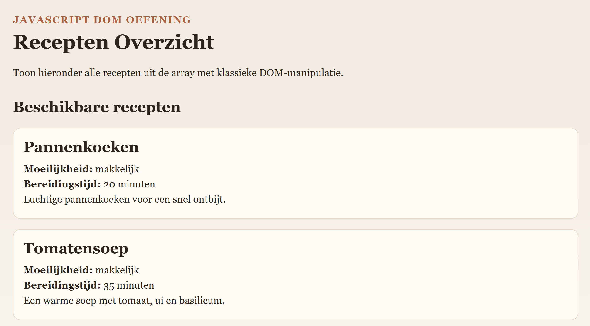

# Examenopdracht: Recepten Overzicht

Maak een eenvoudige webpagina waarop een lijst met recepten wordt getoond met klassieke JavaScript DOM-manipulatie.

## Doel

Gebruik een array van objecten en render voor elk recept een HTML-item in de pagina.

## Wat krijg je?

- Een HTML-pagina met een lege div voor de inhoud
- Een array met receptobjecten
- Een eenvoudige HTML-template voor 1 recept
- Een JS-script dat al gelinkt is aan het HTML-bestand, en de renderItems functie oproept
- 2 lege functies die je zelf moet opbouwen

## Wat moet je doen?

1. Open de bestanden van deze oefening.
2. Gebruik de array `recipes` uit `app.js`.
3. Maak voor elk recept een HTML-element op basis van de gegeven template (via DOM!)
4. Voeg alle recepten toe aan de pagina.


## Voorbeeldresultaat


## Voorwaarden

Gebruik DOM-methodes. Je kan niet slagen voor dit onderdeel als je enkel de HTML-code opvult!

## Verwachte structuur van 1 recept

```html
<article class="recipe-card">
	<h2>Pannenkoeken</h2>
	<p><strong>Moeilijkheid:</strong> makkelijk</p>
	<p><strong>Bereidingstijd:</strong> 20 minuten</p>
	<p>Luchtige pannenkoeken voor een snel ontbijt.</p>
</article>
```
