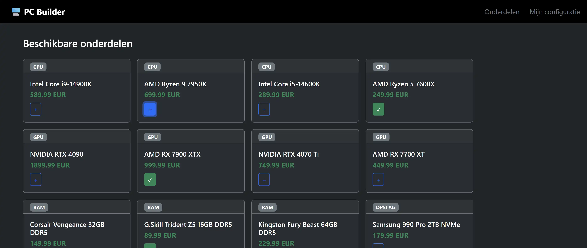
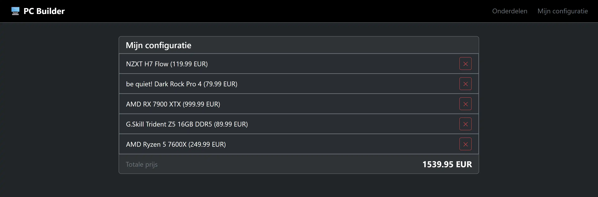
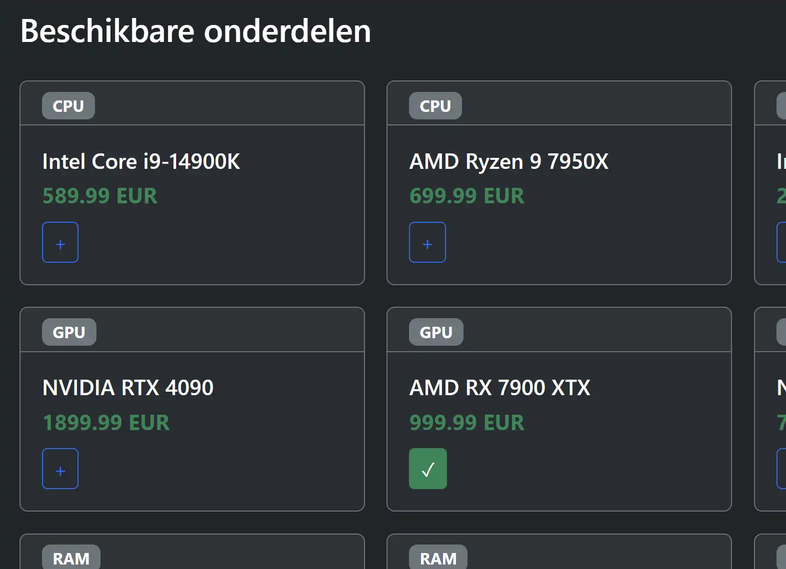
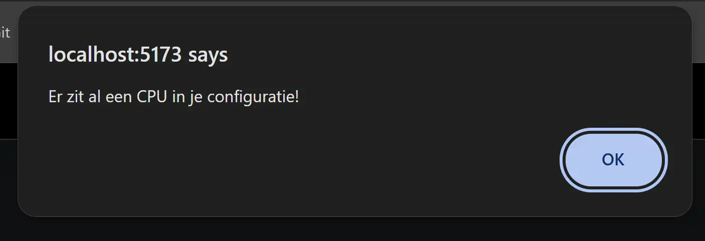
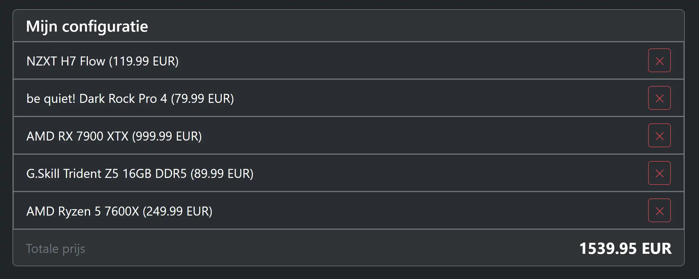
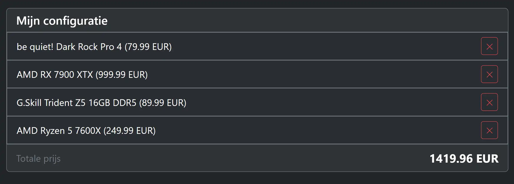

# Examen 2025-2026

Tijdens dit examen bouw je een PC Builder applicatie. Je kan de beschikbare pc-onderdelen raadplegen vanuit een database (via een API) en een eigen pc-configuratie samenstellen in local storage van de browser.

**Je wordt niet beoordeeld op de opmaak (lay-out) van je code.
Als deze niet 100% overeenkomt met de screenshots is dit dus geen probleem.
Je wordt enkel beoordeeld op de functionaliteit.**

Maak doorheen het volledige examen gebruik van TypeScript, zorg ervoor dat de volledige applicatie strongly typed is.

Doorheen het volledige examen is het de bedoeling dat elke wijziging meteen zichtbaar is na het drukken op de knop, niet pas na een refresh/navigate. Dit doe je door correct gebruik te maken van het observer patroon aangereikt in de PersistenceProviders.

INFO: In code worden de Engelse benamingen (part en build) gebruikt in plaats van de Nederlandse (onderdeel en configuratie).

TIP: raak je op een bepaald moment vast omdat je 'rommeldata' hebt, probeer dan eerst om de localstorage data van de localhost te verwijderen in je browser (vraag aan je docent indien onduidelijk).

## Setup

De startbestanden bevatten 2 projecten, een server project en een frontend project. Je past in het server project niets aan, met uitzondering van de backupgegevens terugzetten indien nodig.

Installeer beide projecten in de juiste folders (zoals aangeleerd in de cursus), en start het server project. Controleer in de terminal output dat je server project zeker op poort 3000 draait (achteraan de url). Indien niet roep je de docent er even bij.

## Pagina's & componenten (1 punt)

De startbestanden bevatten twee pagina's en drie custom elementen.
Zorg ervoor dat de pagina's bereikbaar zijn op '/' en '/build'.
Je toont de onderdelen pagina op de root en de configuratiepagina op '/build'.

Zorg er verder ook voor dat de custom elements geregistreerd worden, voor de navbar gebruik je de naam `custom-navbar`,
voor de andere elementen kan je zelf een naam kiezen.
Zorg ervoor dat de links in de navbar correct werken (zoals aangeleerd in de cursus).

TIP: voorzie voor elk van deze componenten en pagina's al een TypeScript bestand met de juiste functie die voorlopig enkel de html toont.
Op deze manier kan je alles al correct oproepen en je werk testen.
De inhoud werk je af later in dit examen en telt nog niet mee voor de punten van deze vraag.

_Onderdelen (home) pagina_

_Configuratie pagina_

## Onderdelen pagina

### Onderdelen/parts inladen en renderen (5 punten)
Gebruik de API (http://localhost:3000/parts) om alle pc-onderdelen in de database op te halen en deze weer te geven op de home pagina.
Gebruik de HTML-code die je in de startbestanden vindt (partCard/part.html) om een custom element te bouwen dat de informatie over één onderdeel weergeeft.

Maak verplicht (en zoals aangeleerd in de cursus) gebruik van de RestPersistenceProvider om de onderdelen op te halen.

Maak voor elk onderdeel een nieuwe instantie van het custom element en voeg deze toe op de correcte plaats om de onderdelen te tonen.

Om de maximumscore op deze vraag te behalen moeten de custom events nog niet afgewerkt zijn, de properties wel.

TIP: Je kan enkel strings doorgeven als properties aan een custom element en de properties ervan moeten in kebab-case (kleine letters en liggend streepje) geschreven zijn en niet in camelCase.

ALTERNATIEF: Krijg je de persistence provider niet aan de praat? Maak dan een array aan van Part objecten en gebruik deze voor maximum 3 van de 5 punten.

### Onderdeel toevoegen aan configuratie/build (4 punten)

Gebruik een custom event in de partCard om een onderdeel toe te voegen aan de configuratie.
Maak verplicht (en zoals aangeleerd in de cursus) gebruik van de LocalStoragePersistenceProvider om de configuratie op te slaan.
Zorg ervoor dat het symbool op de knop wijzigt naar een checkmark (&check;) wanneer het onderdeel al in de configuratie zit.
Als het onderdeel al in de configuratie zit en je klikt opnieuw op de knop, wordt het onderdeel verwijderd uit de configuratie.

Controleer bij het toevoegen of er al een onderdeel van dezelfde categorie in de configuratie zit.
Als dat het geval is, toon dan een meldingspopup en doe verder niets.

## Configuratie pagina

### Configuratie/build inladen en renderen (4 punten)
Maak verplicht (en zoals aangeleerd in de cursus) gebruik van de LocalStoragePersistenceProvider om de configuratie in te laden en weer te geven op de configuratiepagina.

Gebruik het custom element `buildItem` om de informatie over één onderdeel weer te geven in de configuratie.
Gebruik een template literal om de naam en prijs van het onderdeel in 1 regel weer te geven.
Toon ook de totaalprijs van de configuratie.

Om de maximumscore op deze vraag te behalen moet de event nog niet afgewerkt zijn, de properties wel.

### Onderdeel verwijderen uit configuratie/build (2 punten)
Zorg ervoor dat een onderdeel verwijderd kan worden uit de configuratie via de X-knop in het buildItem element.
Maak verplicht (en zoals aangeleerd in de cursus) gebruik van de LocalStoragePersistenceProvider om het onderdeel te verwijderen.

Maak hier geen gebruik van een custom event maar zorg ervoor dat het buildItem element de delete zelf afhandelt.

_GPU & RAM verwijderd uit de configuratie_

