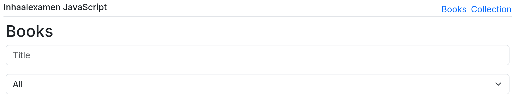
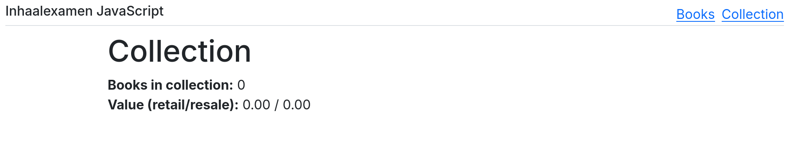
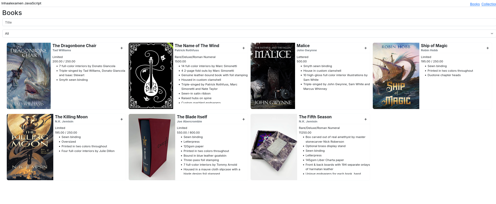
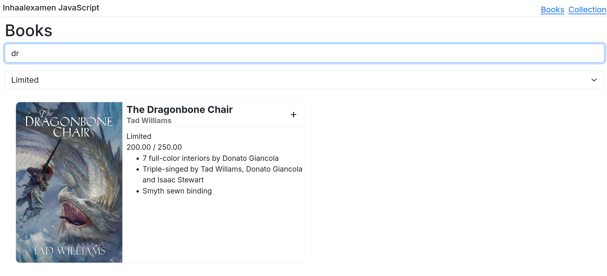
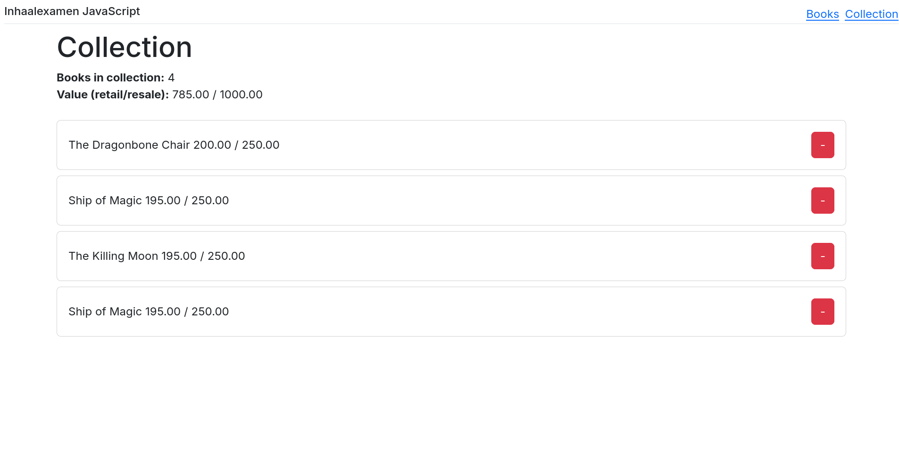

# Inhaalexamen JavaScript 2025

Tijdens dit examen bouw je een applicatie waarmee een collectie boeken beheerd kan worden.

Download de startbestanden.
Deze bevatten twee folders, de _frontend_ map is de map met het JavaScript project waarin je code moet toevoegen, de
_server_ map bevat een API die één route bevat (http://localhost:3000/books) die alle CRUD-operaties ondersteunt
voor de vragen.
Verder bevatten de startbestanden ook _Book_ en _CollectionItem_ interfaces die de data in de applicatie beschrijven.

## Routing (2 punt)

De startbestanden bevatten een custom element dat een navigatiebalk bevat, zorg ervoor dat dit element geregistreerd is
bij de browser en bovenaan de _home_ en _collection_ pagina's staat.

Zorg er tenslotte voor dat beide pagina's bereikbaar zijn via de navigatiebalk.
De home pagina is beschikbaar via `/` en de quizzes pagina via `/collection`.

## Boeken renderen (5 punten)

Gebruik de API om alle boeken in de database op te halen en deze weer te geven op de home pagina.
Gebruik de HTML-code die je in de startbestanden vindt om een custom element te bouwen dat de informatie over één
boek weergeeft.
**Maak verplicht gebruik van de **_RestPersistenceProvider_** om de boeken op te halen.**

TIP: Je kan enkel strings doorgeven als properties aan een custom element.

## Boeken filteren (3 punten)

Gebruik de text input (titel van het boek) en de dropdown (type) om de vragen te filteren.
De filters moeten allebei tegelijkertijd werken en wijzigingen moet direct zichtbaar zijn.

## Boeken toevoegen aan de collectie (3 punten)

Als er op de "+" knop geklikt wordt, moet het boek toegevoegd worden aan de collectie.
Hiervoor maak je verplicht gebruik van een **custom event** om het event door te geven aan de parent component.
Kijk naar de modellen in de startbestanden om te zien wat je moet bewaren voor een item in de collectie en maak gebruik
van de _LocalStoragePersistenceProvider_ om de collectie op te slaan.

Een boek mag meerdere keren toegevoegd worden aan de collectie.

## Collectie tonen (5 punten)

De boeken die toegevoegd zijn aan de collectie moeten getoond worden op de _collection_ pagina.
Gebruik hiervoor de HTML-code die je in de startbestanden vindt om een custom element te bouwen.

Vul verder ook de statistieken aan die je bovenaan de pagina vindt.
Voor de totale waarde van de collectie bereken je de som van de retail en resale prijs van alle boeken in de collectie.
Als er geen resale prijs is, gebruik je de retail prijs.

## Book verwijderen uit de collectie (2 punten)

Als er op de "-" knop geklikt wordt, moet het boek uit de collectie verwijderd worden.
Deze aanpassing moet onmiddellijk zichtbaar zijn op de _collection_ pagina, zowel in lijst van boeken als in de
statistieken.